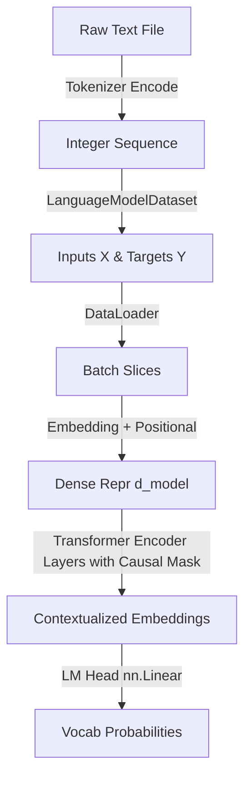

# Conceptual Study Guide & Revision Notes

A direct, analytical, and revision-oriented breakdown of the Transformer-based Character Language Model.

---

## 1. Sequential Slicing & DataLoader Indexing

### Slicing Logic
For language modeling, our goal is autoregressive token prediction. At any step, we predict the next token:
$$x_t \implies y_t = x_{t+1}$$

In [dataset.py](file:///home/msodoki/Desktop/Mathematics/mini-llm-api/src/dataset.py), the dataset defines:
* **Input Sequence ($X$):** `self.data[index : index + seq_len]`
* **Target Sequence ($Y$):** `self.data[index + 1 : index + seq_len + 1]`

### The DataLoader Shuffle Trap
> [!IMPORTANT]
> **DataLoader Indexing Behavior**
> PyTorch's `DataLoader` (when `shuffle=True`) randomly samples indices between `0` and `__len__`. It **does not** step sequentially by `seq_len` (e.g., 0, 64, 128...). 
> Because indices are randomly selected (e.g., 1024, then 5, then 482), our dataset slicing logic in `__getitem__` must be completely self-contained and index-independent.

---

## 2. Positional Encoding: Learned vs. Sinusoidal

| Dimension | Sinusoidal Encoding | Learned Positional Embedding |
| :--- | :--- | :--- |
| **Mechanism** | Static, deterministic math formulas ($\sin, \cos$ at varying frequencies) | Trainable weight matrix optimized via gradient descent |
| **PyTorch Class** | Custom implementation required (no built-in module) | `nn.Embedding(max_len, d_model)` |
| **GPT Standard** | Abandoned after early research | Default standard for GPT-1, GPT-2, GPT-3, and modern LLMs |

### Real-World Blueprint
Modern GPT architectures exclusively use **Learned Positional Embeddings** ([language_model.py](file:///home/msodoki/Desktop/Mathematics/mini-llm-api/src/language_model.py#L16)):
```python
self.pos_emb = nn.Embedding(max_len, d_model)
```
This maps each token position index (0 to `seq_len - 1`) to a dense vector, adding it directly to the token embeddings.

---

## 3. GPT-Style Decoder-Only Architecture & Causal Masking

### The Silent Attention Leak
Standard GPT models are **decoder-only**, meaning they must not attend to future tokens.
In [language_model.py](file:///home/msodoki/Desktop/Mathematics/mini-llm-api/src/language_model.py#L18-L21), we instantiate the layers using:
```python
self.layers = nn.ModuleList([
    nn.TransformerEncoderLayer(d_model=d_model, nhead=num_heads, batch_first=True, norm_first=True) 
    for _ in range(num_layers)
])
```

> [!WARNING]
> **Causal Mask Trap**
> Currently, the forward pass executes:
> ```python
> for layer in self.layers:
>     out = layer(out)
> ```
> Since **no causal mask** (`src_mask`) is passed to `layer(out)`, the attention mechanism is fully **bidirectional** (like BERT). The model can look forward in time, violating the autoregressive constraint.
> 
> **To fix this**, we must generate a upper-triangular causal mask and pass it during forward passes:
> ```python
> seq_len = x.size(1)
> mask = torch.nn.Transformer.generate_square_subsequent_mask(seq_len, device=x.device)
> # ... and pass src_mask=mask to each encoder layer
> ```

---

## 4. Implementation & Data Flow pipeline

